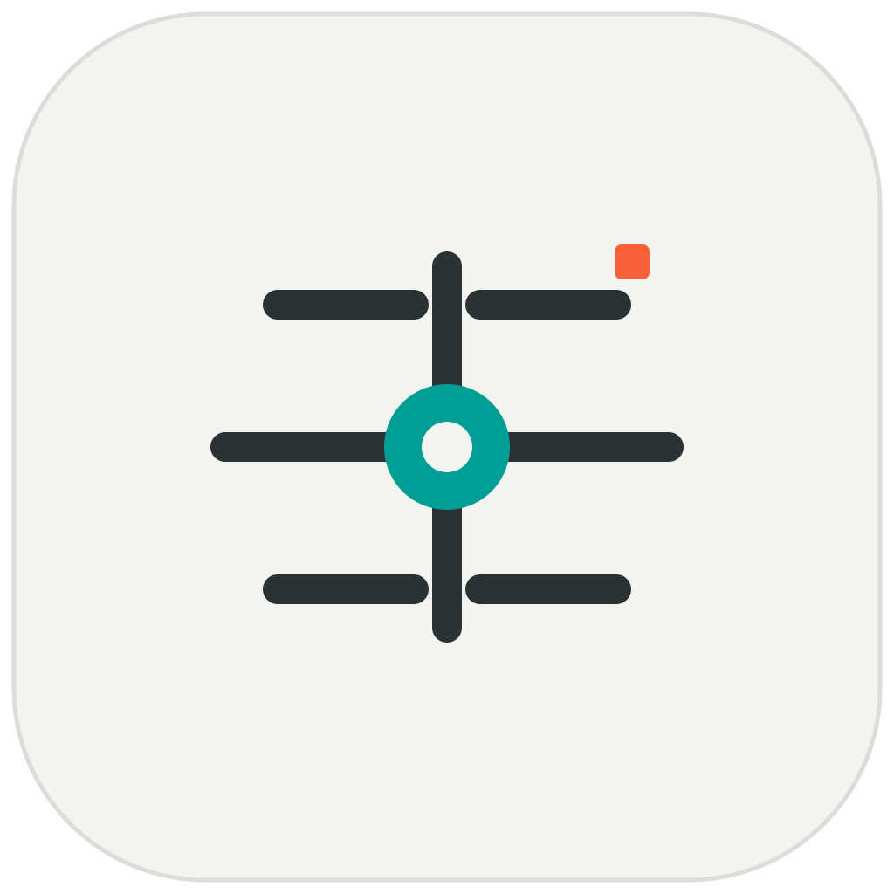
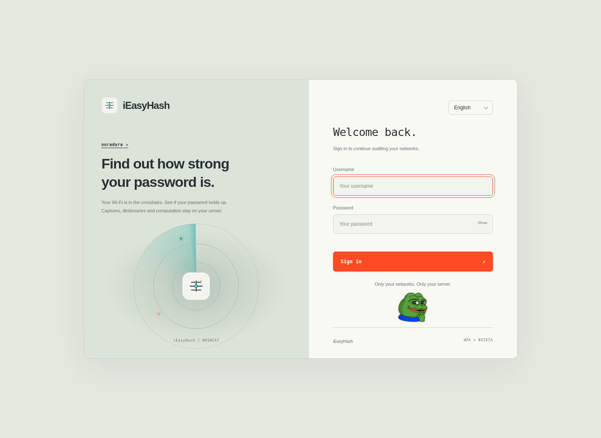
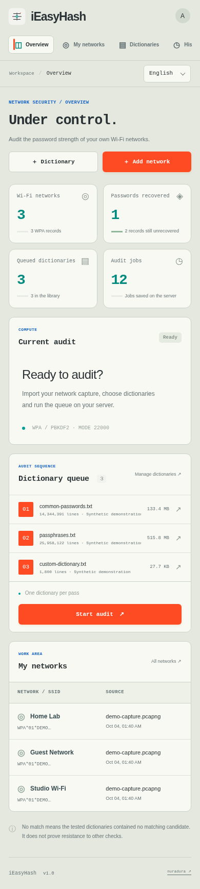
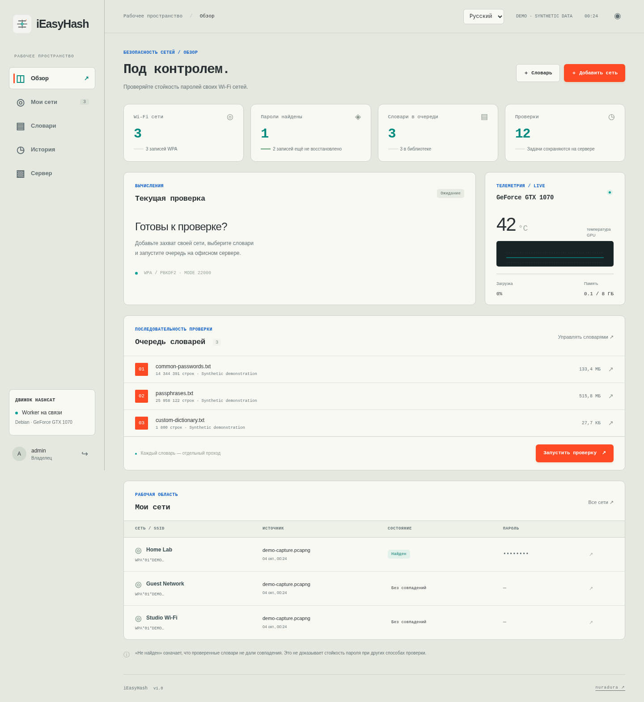
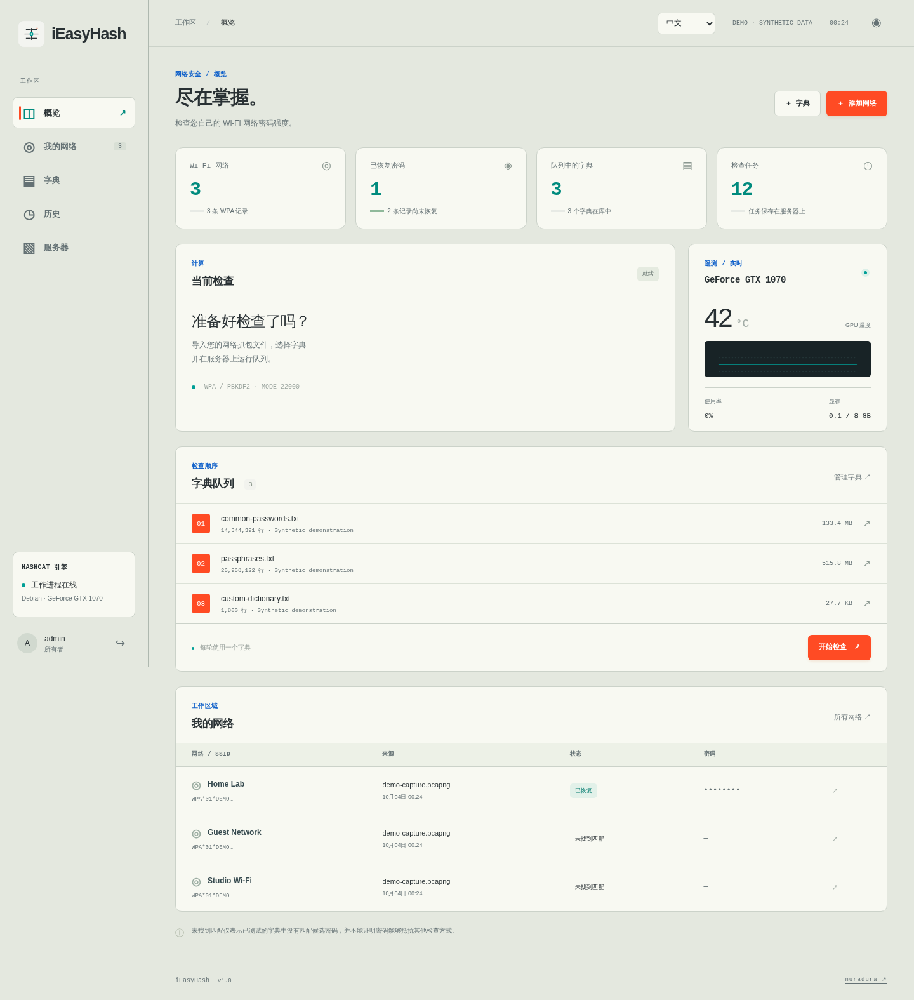
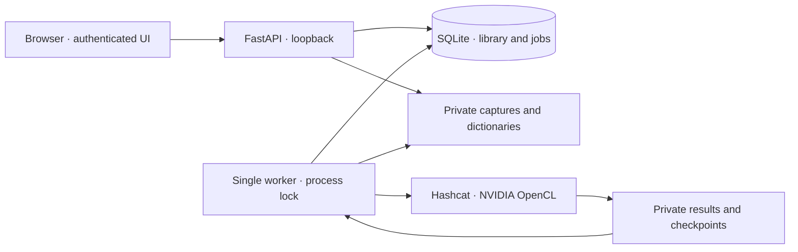

<div align="center">



# iEasyHash

**A self-hosted Wi-Fi password recovery console.**<br>
Your GPU, your dictionaries, your workspace.

[](https://github.com/nuradura/iEasyHash/actions/workflows/tests.yml)


[](LICENSE)

[Install](docs/INSTALL.md) · [Architecture](docs/ARCHITECTURE.md) · [Contributing](CONTRIBUTING.md) · [Author](https://github.com/nuradura)

</div>


<details>
<summary>Login and mobile views</summary>




</details>

## What it does

iEasyHash turns an offline Hashcat workflow into a browser workspace. Import an existing capture, choose your dictionaries, arrange a queue, and follow each pass while an independent worker handles the GPU.

Built with **FastAPI, SQLite, vanilla JavaScript and Hashcat**. The interface uses warm paper surfaces, graphite typography, teal telemetry and orange actions. It is responsive, has no frontend build step, and loads no external fonts or analytics.

## Live progress

The sign-in screen features a radar sweep with fading echoes around the logo, plus a playful frog footnote. Both radar and audit animations respect reduced-motion settings. The `WPA × NVIDIA` label refers to the protocol and accelerator rather than a specific Linux distribution.

Active audits show expanding concentric gradient waves inside the frame and a moving highlight on the progress bar. Hashcat reports measured progress every second; the console polls a lightweight private telemetry endpoint every 500 ms and eases the bar and percentage between samples. Progress never extrapolates beyond a measured value. Motion respects the system's [reduced-motion preference](https://www.w3.org/WAI/WCAG22/Techniques/css/C39), and pauses when the tab is hidden.

## Languages

**English (default) · Русский · 简体中文 (Simplified Chinese)**

Choose a language on the sign-in page or in the console toolbar. Your preference stays saved in this browser across reloads and sign-ins. Pages, dialogs, job statuses, application errors, dates, numbers and CSV headings follow your selection. Network names, filenames and recovered passwords retain their original content.

Project documentation is in English. Contributions for additional languages are welcome; see the [translation guide](docs/TRANSLATIONS.md).

<details>
<summary>See the Russian and Chinese interfaces</summary>




</details>

| Workflow | Capabilities |
| --- | --- |
| Import | PCAP, PCAPNG and CAP conversion through hcxtools; WPA 22000 and HC22000 files; validation and exact deduplication |
| Dictionaries | Local uploads, content checksums, persistent ordering and GitHub imports pinned to a commit |
| GPU queue | One worker, sequential dictionary passes, immutable job inputs, progress, speed and ETA |
| Control | Pause, resume, stop and skip; restart recovery with Hashcat checkpoints |
| Observability | NVIDIA temperature, utilization, memory and power; job and pass history |
| Results | Masked passwords, explicit reveal, authenticated CSV export and private logs |
| Access | Single-owner login, Argon2 password hashing, server-side sessions, CSRF and origin checks |

Only audit networks you own or have permission to test. iEasyHash uses **WPA mode 22000 and dictionary attack mode 0**. It does not capture traffic, connect to wireless networks, or provide arbitrary hash modes or mask attacks.

## Quick start

On a Debian host with a working NVIDIA OpenCL driver, Hashcat and hcxtools:

```bash
git clone https://github.com/nuradura/iEasyHash.git
cd iEasyHash
sudo python3 ops/install.py
```

The installer binds the web service to **127.0.0.1:8787** and saves a generated first password in a private, ignored `FIRST_LOGIN.md` file. For access from another computer, forward the local port:

```bash
ssh -N -L 8787:127.0.0.1:8787 your-user@your-server
```

Open **http://localhost:8787**, sign in and change the password using the account button. For an HTTPS deployment, install with `--public-url https://audit.example.com` and configure your own reverse proxy.

**[Read the full installation guide →](docs/INSTALL.md)** for packages, GPU verification, service management, upgrades and backups. The installer does not install a GPU driver or configure a public endpoint.

## How it is built



The web process accepts uploads and records jobs; the worker runs independently. Each job stores a snapshot of the selected hashes and ordered dictionaries. A file lock prevents competing workers. SQLite keeps library metadata, status and history; runtime files live outside the source tree.

The backend invokes tools with argument arrays, not a shell. Session secrets and initial credentials are generated on the operator's machine. No captures, dictionaries, recovered results, databases or deployment credentials are included in this repository.

## Development

Python 3.13 is the tested runtime.

```bash
python3 -m venv .venv
.venv/bin/python -m pip install -r requirements-dev.txt
.venv/bin/python -m pytest -q tests/test_app.py
```

API tests use temporary directories and synthetic inputs, covering login, CSRF, import validation, deduplication, queue locking, result visibility, password rotation and recovery behavior. GPU integration tests are explicit opt-in:

```bash
.venv/bin/python -m pytest -q -m gpu
```

GPU tests require NVIDIA OpenCL, Hashcat and hcxtools. They generate synthetic PMKIDs and dictionaries; they never use personal captures. CI runs the API suite without requiring a GPU.

To verify the responsive interface and regenerate the screenshots with simulated data:

```bash
.venv/bin/python -m playwright install chromium
.venv/bin/python ops/check_ui.py
```

## Practical limits

- A dictionary miss means **no match in those candidates**, not proof that a password is secure.
- Capture uploads are limited to 64 MiB; dictionary uploads to 2 GiB. A reverse proxy may impose a smaller limit.
- A job supports up to 5,000 WPA records and 100 dictionaries.
- GitHub imports are limited to 50 MB per file; the browser catalog shows up to 1,500 files and reports truncation.
- Resume uses a restore checkpoint. If one has not been written yet, the current dictionary starts again.
- After an unexpected worker restart, the job requires an explicit resume or stop.
- Pass duration is batch timing, not the precise moment an individual password was found.

## Project layout

```text
webapp/                 FastAPI routes, storage, worker, templates and static assets
ops/                    Installer and hardened systemd service units
tests/                  API and synthetic GPU integration tests
docs/                   Installation, architecture and demo screenshots
requirements.lock       Pinned application dependencies
requirements-dev.txt    Test and browser tooling
```

## Credits

Created by **[nuradura](https://github.com/nuradura)**. Powered by [Hashcat](https://hashcat.net/hashcat/) and [hcxtools](https://github.com/ZerBea/hcxtools).

MIT licensed. Third-party tools retain their own licenses.
